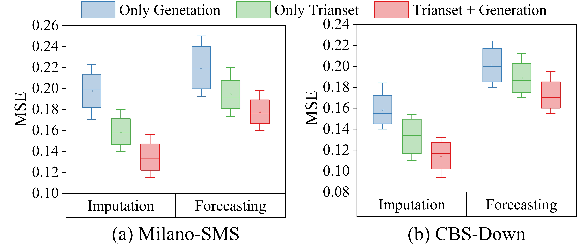

<div align="center">
  <h1>
        🎯 Seed-GIF: A Unified Diffusion Model for Long-Term Wireless Traffic Generation, Imputation, and Forecasting
  </h1> 
  
  
  
  

  [](https://github.com/Anoise/Seed-GIF/blob/main/LICENSE) 
  
  

</div>


> 📖 **Intro:**  In this repo, we focus on large-scale, long-term WT data, and proposes to capture the macroscopic variation patterns of WT by unifying and enhancing the Generation, Imputation, and Forecasting (GIF) tasks. In detail, we propose a unified State-space-enhanced encoder-decoder diffusion model (Seed) to implement long-term WT-GIF tasks by manipulating different guidance signals. Then, we compare the proposed method to various state-of-the-art methods on large-scale WT datasets.

<p align="center">
  
  <br>
  <b>Figure 1</b>: Network nodes often encounter data inaccessibility or loss due to privacy protection measures, transmission instability, and storage limitations. WT Generation, Imputation, and Forecasting (WT-GIF) can cope well with these issues. 
</p>

## 🌟 1. Contributions

 - It is find that ubiquitous time series (TS) forecasting models are prone to severe overfitting.
 - We renovate the vanilla Transformer by reorienting the information aggregation mechanism from addition to subtraction. And an auxiliary output branch is incorporated into each block of the original model to construct a highway leading to the ultimate prediction.
 - The proposed Seed facilitates the learning-driven implicit progressive decomposition of the input and output streams, empowering the model with heightened versatility, interpretability, and resilience against overfitting.
 - Seed outperform existing state-of-the-art methods, yielding an average performance improvement of **11.9%** across various datasets.

 <div align=center></div>


## 🌟 2. Training and Testing Seed

### ⚙️ 1) Dataset 
The datasets can be obtained from [Google Drive](https://drive.google.com/drive/folders/1Yu-_PXzOSEqfTZbAO8cKptVXU3Cz9o3T?usp=drive_link).

### 🎁 2) Clone the code repository
```git
git clone git@github.com:Anoise/Seed-GIF.git
```

### 🚀 3) Training on Milano Dataset
Go to the directory "Seed-GIF/", then run the code like this:

 ```
python main.py --name {name} --config_file {config.yaml} --gpu 0 --train
```

<details>
 <summary> 🚩 Details of Running the Code </summary>

### SIS-IN

#### Generation

```
python main.py --name SMS-IN --config_file configs/sms_in.yaml --gpu 0
```

#### Forcasting

- Training
```
python main.py --name SMS-IN --config_file configs/sms_in.yaml --gpu 0 --train --mode predict
```

- Testing
```
python main.py --name SMS-IN --config_file configs/sms_in.yaml --gpu 0 --sample 1 --mode predict
```

- Testing with --missing_ratio
```
python main.py --name SMS-IN --config_file configs/sms_in.yaml --gpu 0 --sample 1 --mode predict --missing_ratio 0.8
```

#### Imputation

- Training
```
python main.py --name SMS-IN --config_file configs/sms_in.yaml --gpu 0 --train --mode infill
```

- Testing
```
python main.py --name SMS-IN --config_file configs/sms_in.yaml --gpu 0 --sample 1 --mode infill --missing_ratio 0.2
```

### SIS-OUT

#### Forcasting

- Training
```
python main.py --name SMS-OUT --config_file configs/sms_out.yaml --gpu 1 --train --mode predict
```

test
```
python main.py --name SMS-OUT --config_file configs/sms_out.yaml --gpu 1 --sample 1 --mode predict
```

#### Imputation

- Training
```
python main.py --name SMS-OUT --config_file configs/sms_out.yaml --gpu 1 --train --mode infill
```
- Testing
```
python main.py --name SMS-OUT --config_file configs/sms_out.yaml --gpu 1 --sample 1 --mode infill --missing_ratio 0.2
```

### Call-IN

#### Forcasting

- Training
```
python main.py --name Call-IN --config_file configs/call_in.yaml --gpu 2 --train --mode predict
```

- Testing
test
```
python main.py --name Call-IN --config_file configs/call_in.yaml --gpu 2 --sample 1 --mode predict
```

#### Imputation

- Training
```
python main.py --name Call-IN --config_file configs/call_in.yaml --gpu 2 --train --mode infill
```
- Testing
```
python main.py --name Call-IN --config_file configs/call_in.yaml --gpu 2 --sample 1 --mode infill --missing_ratio 0.2
```


### Call-OUT

#### Forcasting

- Training
```
python main.py --name Call-OUT --config_file configs/call_out.yaml --gpu 3 --train --mode predict
```

- Testing
```
python main.py --name Call-OUT --config_file configs/call_out.yaml --gpu 3 --sample 1 --mode predict
```

#### Imputation

- Training
```
python main.py --name Call-OUT --config_file configs/call_out.yaml --gpu 3 --train --mode infill
```
- Testing
```
python main.py --name Call-OUT --config_file configs/call_out.yaml --gpu 3 --sample 1 --mode infill --missing_ratio 0.2
```

### Internet

#### Forcasting

- Training
```
python main.py --name Internet --config_file configs/internet.yaml --gpu 4 --train --mode predict
```

- Testing
```
python main.py --name Internet --config_file configs/internet.yaml --gpu 4 --sample 1 --mode predict
```

#### Imputation

- Training
```
python main.py --name Internet  --config_file configs/internet.yaml --gpu 4 --train --mode infill
```
- Testing
```
python main.py --name Internet --config_file configs/internet.yaml --gpu 4 --sample 1 --mode infill --missing_ratio 0.2
```
</details>


## 🌟 3. Evaluation Metrics

<details>
<summary> Context-Frechet Inception Distance (Context-FID) score </summary>
The Context-FID score is derived by substituting the Inception model used in the original FID with TS2Vec, a method specialized in time series representation learning. It has been demonstrated that models with lower Context-FID scores align with superior performance in downstream tasks, and that there is a positive correlation between the Context-FID score and the generative model's forecasting ability in downstream applications.
</details>

<details>
<summary> Correlational score </summary>
Correlational score estimate the covariance of the i-th and j-th feature of generated time series as 
<div align=center></div>
Therefore, the correlation score between the ground truth and generated data is calculated by
<div align=center></div>
where `Cov' are the covariance matrices of the real data and generated data, respectively.
</details>


<details>
<summary> Predictive score </summary>
The predictive score is calculated as the mean absolute error (MAE), which assesses the discrepancy between predicted values and ground-truth values in the test data. 
We replicate the experimental setup of TimeGAN to evaluate the predictive score.
For this purpose, both the classifier and the sequence-prediction model employ a neural network architecture comprising two GRU layers.
</details>


## 🌟 4. Performace on Generation

The generated distribution of SSD-GIF, SSSD, DSPD, CSPD, TimeGAN, and TimeVAE are shown in the figure below. The original distribution is scaled by the x-axis if the synthetic distribution has a large range. It can be seen that the proposed SSD-GIF can generate data that is more similar to the original data than other models. 

<div align=center></div>

To better observe the patterns in the generated data, we visualized the generated WT data against the real data in the figures below. It is evident that SSD-GIF can generate intrinsic patterns and features identical to those of the real data, demonstrating its excellent performance in generative tasks.

<div align=center></div>

<div align=center></div>

## 🌟 5. Performace on Imputation

Seed achieves the consistent SOTA performance across all datasets and prediction length configurations.

<div align=center></div>

<div align=center></div>

## 🌟 6. Performace on Forecasting

For clarity and comparison among different models, we present supplementary prediction showcases for two representative datasets in figures below.  
These showcases correspond to predictions made by the following models: Periodformer, FEDFormer, Autoformer, Informer, and Flowformer. Among the various models considered, the proposed Seed stands out for its ability to predict future series variations with exceptional precision, demonstrating superior performance.

<div align=center></div>

<div align=center></div>


## 🌟 7. Generate Enhanced Imputation and Forecasting

We found that the model with the Trainset+Generation setup performs the best, the model using only the Trainset ranks second, and the model trained only with generated samples has relatively poor performance. 

<div align=center></div>


## 🌟 8. Good Interpretability

Visualization depicting the output of Seed. As expected, the trend curve follows the overall shape of the signal, while the season shows regular fluctuations. It can be seen that the reconstructed samples are highly consistent with the true values.

<div align=center></div>


## 🌟 9. Citations

```
Citations will be coming soon！
```

